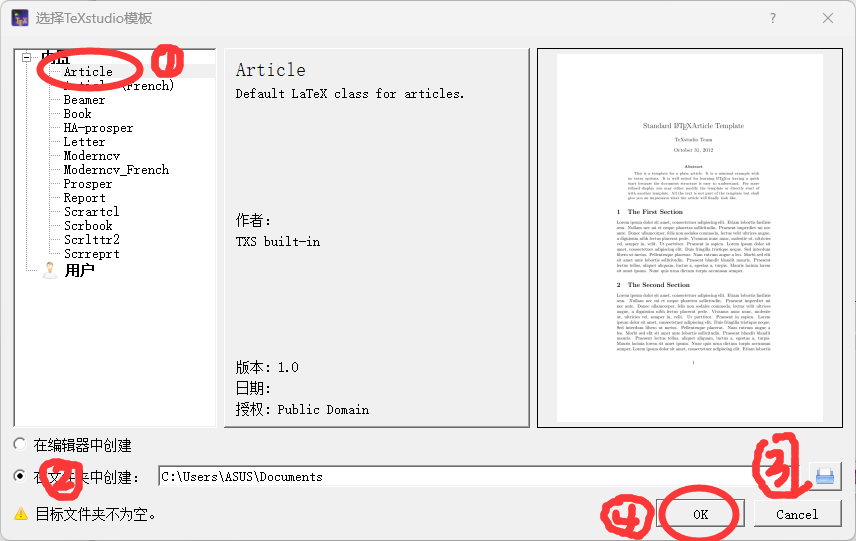
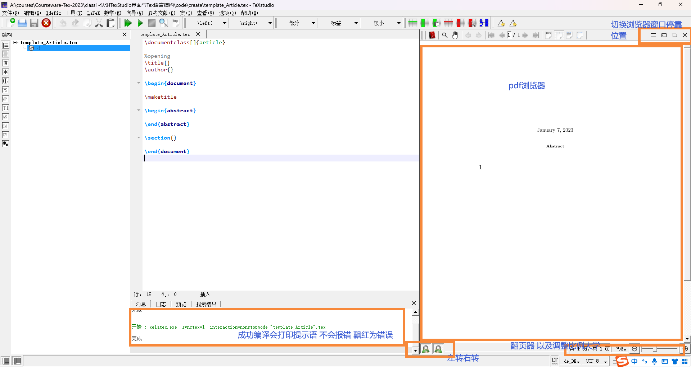
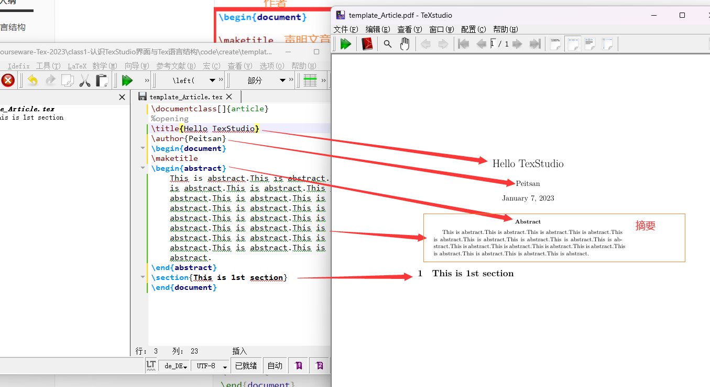

# 认识TexStudio界面与Tex语言结构

## 	上手TexStudio

- **1.使用内置模板创建一个Tex工程**
  - 打开TexStudio软件 
  - 在左上角依次找到点击 ”文件“-"从模板新建“,点击新建内置模板工程
  - “选择一个内置模板”—>选中"在文件夹中创建"—>"将工程保存到自定义的目录下面"—>"OK"结束创建

​				**建议修改文件目录统一到一个固定的位置 避免正式打比赛的时候找不到**

- **2.认识Tex软件界面**
  - 打开大纲视图（左下角第一个按键）
  
  - 编译你的Tex工程
  - 编译你的Tex工程

​				**注意：编译生成pdf文件后请勿在wps、 word等软件打开该pdf文件 只能在TexStudio中浏览 不然文件权限不足无法进行编译**

- 认识Tex工程文件目录

  - 找到刚才保存的目录 经过编译后文件夹下会有以下几个基础文件。

  ​		**注意：初学只要记住最终提交论文时只要提交这里的pdf文件即可**

  ​	**为了保证文件正确编译,文本格式都使用UTF-8,默认都是,不要用gbk**

## 认识Tex语言基础结构

 - **1.回到Tex的代码编辑框,刚才用Tex内置模板创建了工程，预置了基础结构。**
   - 基础内容
   -     


- **2.尝试运用基础标签**

  - 向标签内插入基础内容

    ```tex
    \documentclass[]{article}
    %opening
    \title{Hello TexStudio}
    \author{Peitsan}
    \begin{document}
        \maketitle
        \begin{abstract}
            This is abstract.This is abstract.This is abstract.This is abstract.This is abstract.This is abstract.This is abstract.This is abstract.This is abstract.This is abstract.This is abstract.This is abstract.This is abstract.This is abstract.This is abstract.This is abstract.This is abstract.
        \end{abstract}
    \section{This is 1st section}
    \end{document}

  - 编译Tex,pdf浏览器出现如图的排版结果

## 使用Tex搭建一个基础的数模论文模板

- **数模论文基本结构**
  - 