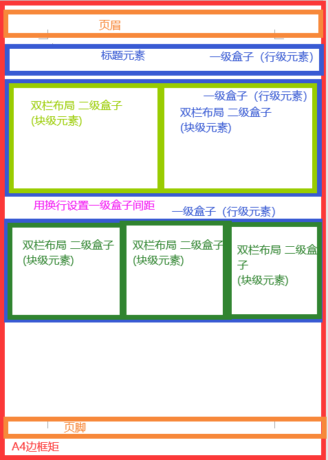
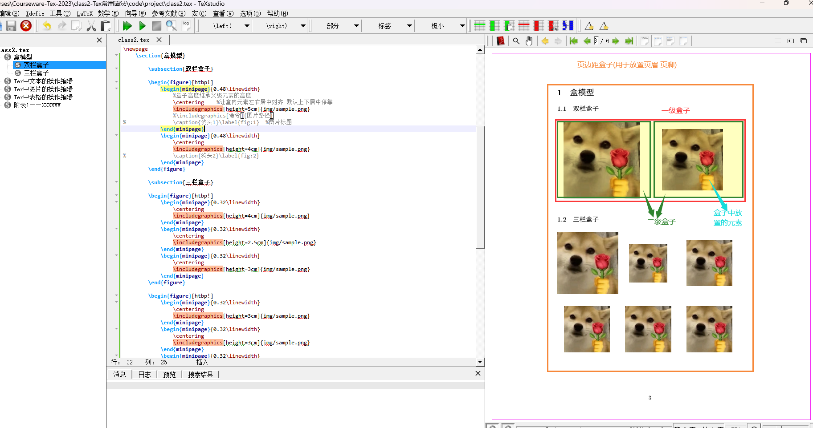

# Tex常用语法

## 	Tex中的盒子模型
- 1.盒子模型(Box)
	- 概念:盒子模型是一个布局概念。一个pdf文件中包含有多种元素: 文本、图片、表格、超链接等。怎么确定元素的位置,就需要用到布局,常用的Tex布局有：盒模型、网格布局、浮动布局。
	
	- 由于页面布局(layout)技术段位较高,本文为了应付数模论文需求，只将最基础的盒模型布局,其他的布局方案可以参照这些文章自己钻研：
	  [ 1.如何使用Tex，Latex，ConTeXt创建自定义布局/更改标题背景颜色？](https://www.coder.work/article/6318932)
	   [2.Tex之版面布局设计](https://blog.csdn.net/weixin_33834679/article/details/91996622)
	
	- 盒模型的设计思维：
	
	  
	
	- 在Tex中实现盒模型布局:
		- 分栏标签:
 ``` tex
                \begin{父标签}[!htpb]
                        \begin{minipage}{占父级标签的宽度百分比\linewidth}
                        %子标签中的高度会继承父标签的高度
                        \end{minipage}
                        \begin{minipage}{占父级标签的百分比\linewidth}
            
                        \end{minipage}
                \end{父标签}
 ```
-   2.盒子模型实例:
  -   1.双栏排版:
    ```tex
           \begin{figure}[htbp!]
                \begin{minipage}{0.48\linewidth}
                    %盒子高度继承父级元素的高度
                    \centering    %让盒内元素左右居中对齐 默认上下居中停靠
                    \includegraphics[height=5cm]{img/sample.png}
                    %\includegraphics[命令]{图片路径}
    %				\caption{狗头1}\label{fig:1}  %图片标题
                \end{minipage}
                \begin{minipage}{0.48\linewidth}
                    \centering
                    \includegraphics[height=4cm]{img/sample.png}
                \end{minipage}
            \end{figure}
    ```

  - 2.三栏排版:
     ```tex
                        \begin{figure}[htbp!]
                    \begin{minipage}{0.32\linewidth}
                        \centering    
                        \includegraphics[height=4cm]{img/sample.png}
                    \end{minipage}
                    \begin{minipage}{0.32\linewidth}
                        \centering    
                        \includegraphics[height=2.5cm]{img/sample.png}
                    \end{minipage}
                    \begin{minipage}{0.32\linewidth}
                        \centering
                        \includegraphics[height=3cm]{img/sample.png}
                    \end{minipage}
                \end{figure}
     ```
    - 盒子排版效果
  
- 3.Tex中常用到的布局间距标签(了解)
    ```tex
    % ================= 设置版面，A4 页面高 29.7cm, 宽 21.0cm ================ %
    % 1英寸(inch) = 2.54 cm
    % 水平左边空距，默认为 1in + \hoffset %
    \setlength{\hoffset}{-0.54cm}
    % 垂直上边空距，默认为 1in + \voffset %
    \setlength{\voffset}{-0.54cm}
    % 纸张内侧边界: 水平边空距 + \oddsidemargin (奇数页的左边界) = 2.00cm %
    \setlength{\oddsidemargin}{0cm}
    % 纸张外侧边界: 水平边空距 + \evensidemargin (偶数页的左边界) = 2.00cm %
    \setlength{\evensidemargin}{0cm}
    % 版心 17.0cm + 内侧边界 2.00cm + 外侧边界 2.00cm = 21.0cm %
    \setlength{\textwidth}{17.0cm}
    % 上页边到页眉的距离 %
    \setlength{\topmargin}{0.90cm}
    % 标题行高度 %
    \setlength{\headheight}{0.55cm}
    % 正文到标题的间距 %
    \setlength{\headsep}{0.45cm}
    % 正文底部到页脚距离 %
    \setlength{\footskip}{0.90cm}
    % 版心高度 22.90cm + 上页边空距 2.00cm + 页边页眉距 0.90cm + 标题行高 0.55cm %
    %         + 正文标题距 0.45cm + 正文页脚距 0.90cm + 下页边空距 2.00 = 29.70cm %
    \setlength{\textheight}{22.90cm}
    % ============================================================================== %
    \renewcommand{\baselinestretch}{1.2}                                % 行距
    \setlength{\parskip}{2.0ex plus0.1ex minus0.2ex}                 % 段落间距
    \setlength{\parindent}{0.6cm}                                        % 段首缩进
    \renewcommand{\CJKglue}{\hskip 0pt plus 0.08\baselineskip}         % 汉字字距
    ```
    
    ## 	Tex中文本的操作编辑
    - 1. 缩进与空格
         - 1. Tex中段落默认首行缩进
         - 2.取消首行缩进：
    		          在段落最前面添加 \noindent 
    		
    		 - 3.Tex直接用空格键敲空格是不会生效的,必须用如下的空格转义符。
                    ```tex
                                        %latex中通常会设置基单位m作为尺寸的比例尺基,一般设置m = 2cm;
                                        a \qquad b % 空格两个m的宽度
                                        a \quad b  % 空格一个m的宽度
                                        a\ b 	   % 空格1/3m的宽度
                                        a\;b 	   % 空格2/7m的宽度
                                        a\,b 	   % 空格1/6m的宽度
                                        a\!b 	   % 靠近紧贴1/6m的宽度
                    ```
	  
    - 2. [加粗、斜体、下划线、正文仿宋](https://blog.csdn.net/weixin_36670529/article/details/106468778)	
         
         - 1.加粗：\textbf{加粗文字}
         
         - 2.斜体：\textit{变斜体强调文字}
         
         - 3.下划线：\underline{下划线}	
         
         - 4.正文仿宋：\texttt{正文仿宋}	
         
    
    - 3. [修改字号](https://blog.csdn.net/weixin_36670529/article/details/106468778)		
        - 1.认识字号
          			- Tex中的字号从小到大依次如下:
    
             ```tex
                				 \tiny
                	             \scriptsize
                	             \footnotesize
                	             \small
                	             \normalsize
                	             \large
                	             \Large
                	             \LARGE
             	             \huge
              	             \Huge
          ```
       - 2.caption标题字号 \captionsetup{font={字号}}
         			- 用例  \captionsetup{font={small}}
      - 3.正文字号 \字号{准备变小的文字}
       				 				 				
       				 -  用例  \small{准备变小的文字}
      
## 	Tex中图片的操作编辑
  - 1. 引入图片宏包

```tex
	\usepackage{subfigure} %引入图片插入宏包
	\usepackage[graphicx]{realboxes} %引入图片插入宏包
```
  - 2. 图片标题 

```tex
	\caption{是一个狗头}
```
  - 3.图片位置左右居中

```tex
	\centering
```
  - 4.图片编号标签

```tex
	\label{fig:序号}
```
  - 5.声明环境并引入图片

```tex
	\begin{figure} %声明图片环境
		\centering %图片位置左右居中
		\captionsetup{font={small}}%修改图片标题字号
		\includegraphics[对图片的操作命令]{图片路径}
		\caption{图片标题}
		\label{fig:序号}
	\end{figure}	
```
  - 6.用例

```tex
		\begin{figure}
			\centering
			\captionsetup{font={small}}%修改标题字号
			\includegraphics[height=4cm,width=4cm]{./img/sample.png}%图片长宽设置为4cm,图片路径在img文件下(记得带上文件类型名)
			\caption{是一个狗头}
			\label{fig:10}
		\end{figure}
```
## 	Tex中表格的操作编辑
 - 1. 引入表格制表符宏包

```tex
	\usepackage{booktab} %引入图片插入宏包
```
  - 2. 图片标题 

```tex
	\caption{是一个表格} %表题在下方 一般比正文小一号自 所以要设置字号
```
  - 3.图片位置左右居中

```tex
	\centering
```
  - 4.三种表格环境
    

```tex
	\subsection{center环境下的表格}
            \begin{center}  %center居中分散对齐环境
                \begin{tabular}{cc} %表格主题环境{cc} 表示表格有两列 且居中(center->c)
                    \hline  		%细直线
                    \makebox[0.45\textwidth][c]{符号}	& \makebox[0.45\textwidth][c]{意义}                       \\ \hline   %makebox为创建表格列 参数0.45\textwidth表示文字宽度占比45%
                    Symbol  & Meanings \\ \hline %表格数据正文 用&分开 没一行最后要有换行符\\
                \end{tabular}
        \end{center}
	\subsection{table环境下的表格}
        \begin{table}[htbp!]
            \begin{tabular}{ccc}
                \hline
                \makebox[0.25\textwidth][c]{符号}	& \makebox[0.35\textwidth][c]{意义} & \makebox[0.2\textwidth][c]{单位}	 \\ \hline
                Symbol  & Meanings & Units\\ \hline
            \end{tabular}
        \end{table}
	\subsection{table*环境下的表格}
            \begin{table*}[htbp!]
            \centering
            \begin{tabular}{ccc}
                \toprule[1.5pt]
                \makebox[0.25\textwidth][c]{符号}	& \makebox[0.35\textwidth][c]{意义} & \makebox[0.2\textwidth][c]{单位}	 \\ \hline
                Symbol  & MeaningsMeaningsMeaningsMeanings & Units\\
                \bottomrule
            \end{tabular}%
            \label{tab:addlabel}%
            \end{table*}%
```
  - 6.用例

```tex
		\begin{table}
		\caption{这是一个表格} 		%设置表格标题
		\captionsetup{font={small}} %设置表格字号
		   \begin{tabular}{cc} %表格主题环境{cc} 表示表格有两列 且居中(center->c)
                    \hline  		%细直线
                    \makebox[0.45\textwidth][c]{符号}	& \makebox[0.45\textwidth][c]{意义}                       \\ \hline   %makebox为创建表格列 参数0.45\textwidth表示文字宽度占比45%
                    Symbol  & Meanings \\ \hline %表格数据正文 用&分开 没一行最后要有换行符\\
                \end{tabular}
		\end{table}
```

- [Tex表格在线生成工具]([Create LaTeX tables online – TablesGenerator.com](https://www.tablesgenerator.com/))

  - 记得表格粘贴后需要去除颜色 修改为三线表
  - 对于数据大量的表格不适用  数据量大建议用Pandas处理

- [使用Python将Excel表格转换为Tex格式打印](https://blog.csdn.net/weixin_43823679/article/details/120231186)

  - 使用pandas打印excel表格 可以写for循环按指定条数打印出多个表格 这样就可以分页了

    `import pandas as pd`
    `table=pd.read_excel('test.xlsx')`

    `print(table.to_latex(index=False,label='ccdd'))`

